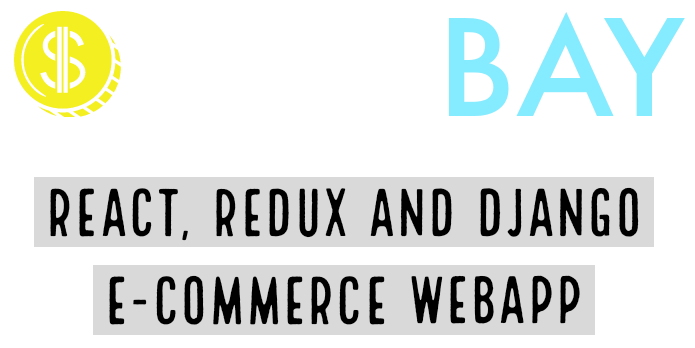

## Get Started
```
# Move to frontend directory
cd frontend

# Install dependencies
npm install

# Run develepment server
npm start


# Serve API on localhost:8000
python backend/manage.py runserver


# Build for production
npm run build
```
